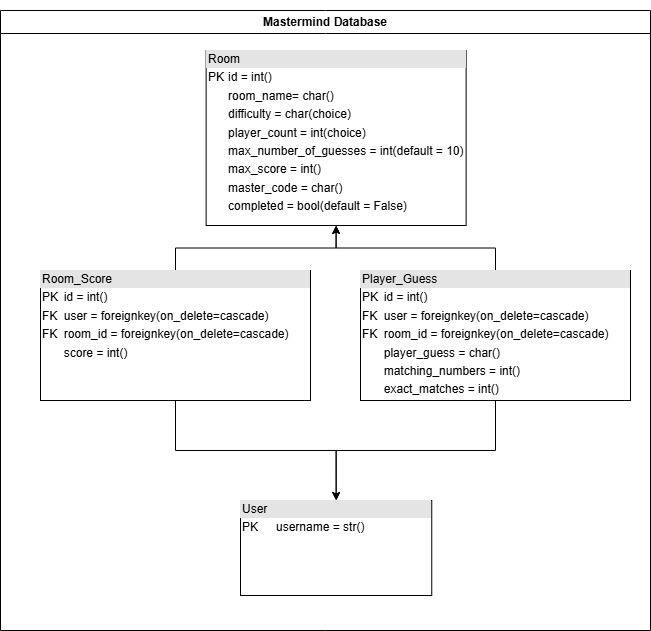

<!-- Improved compatibility of back to top link: See: https://github.com/othneildrew/Best-README-Template/pull/73 -->
<a id="readme-top"></a>
<!--
*** Thanks for checking out the Best-README-Template. If you have a suggestion
*** that would make this better, please fork the repo and create a pull request
*** or simply open an issue with the tag "enhancement".
*** Don't forget to give the project a star!
*** Thanks again! Now go create something AMAZING! :D
-->


<!-- PROJECT SHIELDS -->
<!--
*** I'm using markdown "reference style" links for readability.
*** Reference links are enclosed in brackets [ ] instead of parentheses ( ).
*** See the bottom of this document for the declaration of the reference variables
*** for contributors-url, forks-url, etc. This is an optional, concise syntax you may use.
*** https://www.markdownguide.org/basic-syntax/#reference-style-links
-->

<!-- PROJECT LOGO -->
<br />

<h3 align="center">Mastermind app</h3>

  <p align="center">
    A web based mastermind game for you and your friends! 
    <br />
    <a href="https://github.com/JLv10B/mastermind_app"><strong>Explore the docs »</strong></a>
    <br />
  </p>
</div>


<!-- TABLE OF CONTENTS -->
<details>
  <summary>Table of Contents</summary>
  <ol>
    <li>
      <a href="#about-the-project">About The Project</a>
      <ul>
        <li><a href="#built-with">Built With</a></li>
      </ul>
    </li>
    <li>
      <a href="#getting-started">Getting Started</a>
      <ul>
        <li><a href="#prerequisites">Prerequisites</a></li>
        <li><a href="#installation">Installation</a></li>
      </ul>
    </li>
    <li><a href="#usage">Usage</a></li>
    <li><a href="#datastructure">Datastructure</a></li>
    <li><a href="#codestructure">Codestructure</a></li>
    <li><a href="#roadmap">Roadmap</a></li>
  </ol>
</details>


<!-- ABOUT THE PROJECT -->
## About The Project

The mastermind app is a web based mastermind game, which can be played against the computer. This is a game where a you try to guess a randomly generated number combination aka. master code. At the end of each attempt to guess the master code, the computer will provide feedback on how many numbers you have guessed correctly, as well as how many exact matches. You must guess the right number combination within 10 attempts to win the game. The app supports both single player play against the computer with varying difficulty. The app also supports multiplayer play where players compete to guess the master code before their competitors, again with varying levels of difficulty. The mastermind app is built on the django web framework using python for the backend and HTML for the front end.

<p align="right">(<a href="#readme-top">back to top</a>)</p>


### Built With

* Django
* Python 3.11.3

<p align="right">(<a href="#readme-top">back to top</a>)</p>


<!-- GETTING STARTED -->
### Prerequisites


* Django
* Djangorestframework
* requests
  ```sh
  pip install django
  pip install djangorestframework
  pip install requests
  ```

### Installation

1. Clone the repo
   ```sh
   git clone https://github.com/JLv10B/mastermind_app.git
   ```
2. Install NPM packages
  ```sh
  pip install django
  pip install djangorestframework
  pip install requests
  ```
3. Make migrations
  ```sh
  python manage.py makemigrations
  ```
4. Migrate
  ```sh
  python manage.py migrate
  ```
5. Runserver
  ```sh
  python manage.py runserver
  ```


<p align="right">(<a href="#readme-top">back to top</a>)</p>


<!-- USAGE EXAMPLES -->
## Usage

Creating a room
* First register an account
* Once registered and logged in you can create a new room by entering a name for the room, selecting if it's going to be a single player or multiplayer room, and choosing the difficulty

Single player
* Submit any 4-6 digit number (depending on the difficulty), digits must be 0-7
* Once your guess has been submitted your guess and feedback will populate onto the screen
* The game is completed once you have guessed the master code or you have run out of guesses
* Once the game is completed you can restart the game with a new master code
* You can delete the room at any point and return to the home page

Multiplayer
* Similar to single player gameplay but you cannot submit any guesses until there is another player in the room
* The player that did not create the room must guess first to eliminate any unfair advantage
* Each player must wait until each guessing round completes before entering their next guess
* Players will not be able to get further ahead by guessing faster
* Rounds can end with a winner, tie, or no winners
* The player who guesses the master code in the fewest guesses is the winner and scores 2 points
* If multiple players guess the master code in the same number of guesses then those players are tied and each player scores 1 point
* If no player guesses the master code within 10 guesses, the round ends and no one gets any points
* Rounds can be reset after they are completed, scores carry over to each round but not between rooms
* Rooms can be deleted after any round is completed


<p align="right">(<a href="#readme-top">back to top</a>)</p>

## Datastructure



## Codestructure

1. user_login(request):
    * This function allows user to login
    

2. user_logout(request):
    * This function allows users to log out.

3. register_page(request):
    * This function allows users to register a profile, then redirects them to the home page after logging in.

4. random_pattern_generator(pattern_length):
    * This function generates a random pattern using the random number generator API(https://www.random.org/clients/http/api/). The expected response from the API is a JSON object with nested dictionary. If the reponse is successful then we can return the master_code.
    * example:
        * Input: 
            4
        * Output:
            '1234'

5. validate_player_input(player_input, pattern_length):
    * This function validates player input. Player input should only contain numbers and be the length determined by pattern_length. If the player's input is valid then return True else return False
    * Example:
        * Input:
            player_input = '1123'
        * Output:
            True

6. find_matching_and_exact_matches(player_guess, master_code):
    * This function takes a player's guess and compares it to the master code. It returns 2 integers, the first representing the number of mastching numbers and the second is the amout of exact matches.
    * Example:
        * Input:
            mastercode = '1234'
            player_guess = '0204'
        * Output:
            2,2

7. player_feedback(user, room_id):
    * This function accepts a user object and room_id and returns a list of responses.
    * Example:
        * Input: 
            <user1_obj>
        * Output: 
            ["Guess #1: 1234 || You guessed {x} correct number(s) and have {y} exact matche(s)", ...]

8. create_room_score(request,pk):
    * This function accepts a POST request and creates a new room_score object

9. home_view(request):
    * This view renders the home page with login/logout functions. The player can create a room with a room name and selected difficulty. After the room is created the player is redirected to the created room page. This view should include a form to create a room, a list of all current rooms, and a welcome message.

10. generate_guess(request, pk):
    * This function accepts a POST request and validates the player's input. If the player's input is not valid then it will return False and an error message. If the input is valid then the function will return True. If the input is valid the function creates a player_guess object and check if the player already has a Room_score object associated with them, if not it will be created.

11. single_player_room_view(request, pk):
    * This view renders a singleplayer room and manages the room.completed state. If the player has correctly guessed the master code or reached the maxium number of guesses, the room should be marked at completed. This view should render the all the previous guesses along with their appropriate feedback, guess count, form to allow the player to submit a guess, and room name.

12. multiplayer_room_view(request, pk):
    * This view renders a multiplayer room and manages when the game is completed. If the player has correctly guessed the master code or reached the maxium number of guesses, the points should be distributed to the correct players and room should be marked at completed, players will no longer be able to submit guesses. The view should include the all the previous guesses along with their appropriate feedback, guess count, form to allow the player to submit a guess, scoreboard, and room name.

13. submit_guess_controller(request, pk):
    * This function controls which logic is applied to guess submission requests. Passes the POST request and pk to single player and multiplayer submit guess functions.

14. singe_player_submit_guess(request, pk):
    * This function dictates the logic for when guesses are allowed to be submitted for single player rooms. Players are not able to submit a guess if the room has been marked completed or if they have no more remaining guesses. 

15. multiplayer_submit_guess(request, pk):
    * This function dictates the logic for when guesses are allowed to be submitted for multiplayer rooms. Players cannot submit guesses if they have 1 or more guesses than the player with the fewest guesses. Eg. A player should not be able to submit their 7th guess until everyone in the room has submitted their 6th guess. Accepts a POST request and passes it to the submit_guess function.

16. room_participants_and_guess_count(room_id):
    * This functions accepts the room id and returns a dictionary of all user object in the room and their guess counts {user:guess_count}.
    * Example:
        * Input: 1
        * Output: {<user1_obj>:3, <user2_obj>:3, <user3_obj>:2}

17. error_page_view(request, pk):
    * This view renders an error page along with the appropriate message. Player should be able to return back to the room that they were in when the error occured.

18. restart_game(request, pk):
    * This function allows the player to restart the game with a new master code. It deletes all guesses linked to the room.

19. delete_room(request, pk):
    * This function allows users to delete rooms. If it is a single player room then the player can delete it at any time. If it's a multiplayer room then the room can only be deleted if the room status is set to completed.

<p align="right">(<a href="#readme-top">back to top</a>)</p>

<!-- ROADMAP -->
## Roadmap

- [ ] Allow more configuration for multiplayer rooms
- [ ] Allow for different types of multiplayer modes
- [ ] Timed rounds
- [ ] Player power features that affect other players

<p align="right">(<a href="#readme-top">back to top</a>)</p>


<!-- CONTACT -->
## Contact

James Liaw- jamesliaw10@gmail.com

Project Link: [https://github.com/JLv10B/mastermind_app](https://github.com/JLv10B/mastermind_app)

<p align="right">(<a href="#readme-top">back to top</a>)</p>


